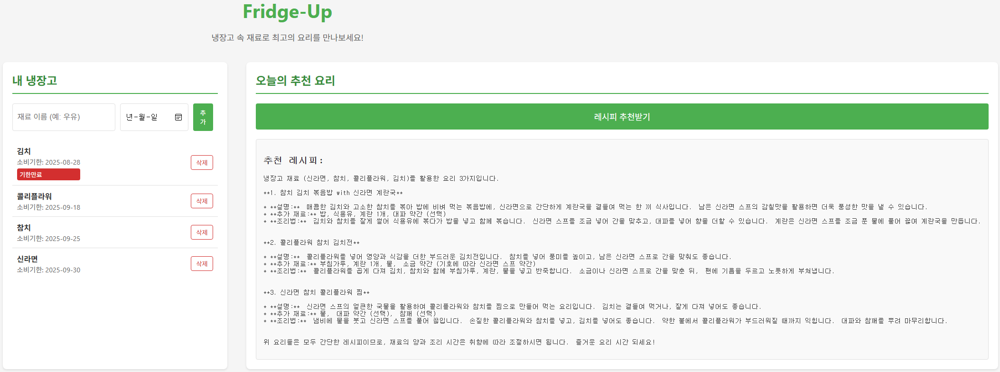

# 냉장고 도우미 (Fridge Helper) - 웹 버전

식재료를 효율적으로 관리하고 음식물 낭비를 줄이는 데 도움을 주는 웹 기반 애플리케이션입니다.

## 주요 기능
*   식재료 목록 추가, 수정, 삭제
*   유통기한 임박 알림 (예정)
*   보유 식재료 기반 레시피 추천 (예정)

## 기술 스택

### Frontend
*   **React.js**: 사용자 인터페이스 구축을 위한 JavaScript 라이브러리
*   **Create React App**: React 애플리케이션 개발 환경 설정

### Backend
*   **JSON Server**: 간단한 REST API를 제공하는 가벼운 Node.js 기반 서버 (개발 및 테스트용)

### 배포
*   **Frontend**: GitHub Pages
*   **Backend**: Vercel (예정)

## 데모
[GitHub Pages에서 데모 보기](https://hojun313.github.io/Fridge-Up/)

## 스크린샷
